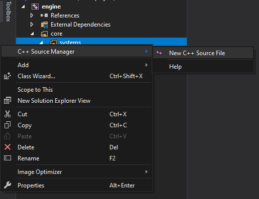
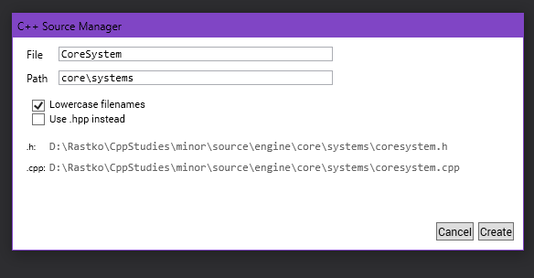

# C++ Source Manager
### Supported VS versions
If a version is supported it means that the plugin is tested and guaranteed to work with the version. This does not mean it won't work with other versions of VS. Versions:
* VS2019

### Overview
`C++ Source Manager` is a Visual Studio plugin that allows you to easily manage files and folders in a C++ project. The main advantage of this tool
comparing to others or a default Visual Studio file manager is that it makes it possible to separate source files from project files.

For example, we can have the following directory structure
```
source\
    myproject\
      systems\
        \*.cpp
        \*.h
      main\
        application.cpp
projects\
    myproject\
    myproject.sln
```
which makes it easier to use any build system, for example **Make** or **CMake**, to genarate project files for Visual Studio or similar IDEs.

#### Usage
1. Right click on the existing folder (filter) / project to access the plugin menu.


2. Name of the folder is relative to the folder (project) you selected. Change file name, pick any other option and change folder if necessary. If folder does
not exist, it will be automatically added.


### Features
Currently, `C++ Source Manager` supports
  - Creating a new source file (Automatically creates .cpp and .h files with very basic class template)
  - Adding a new directory to the project (which also generates filters for VS)

### Credits
* Many thanks to [Mads Kristensen](https://github.com/madskristensen/AddAnyFile) for providing some of the base code for creating VS Extensions.
